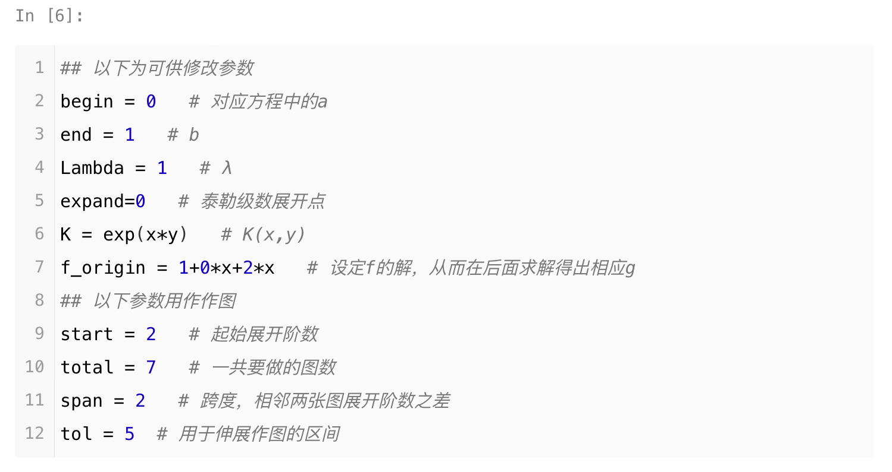
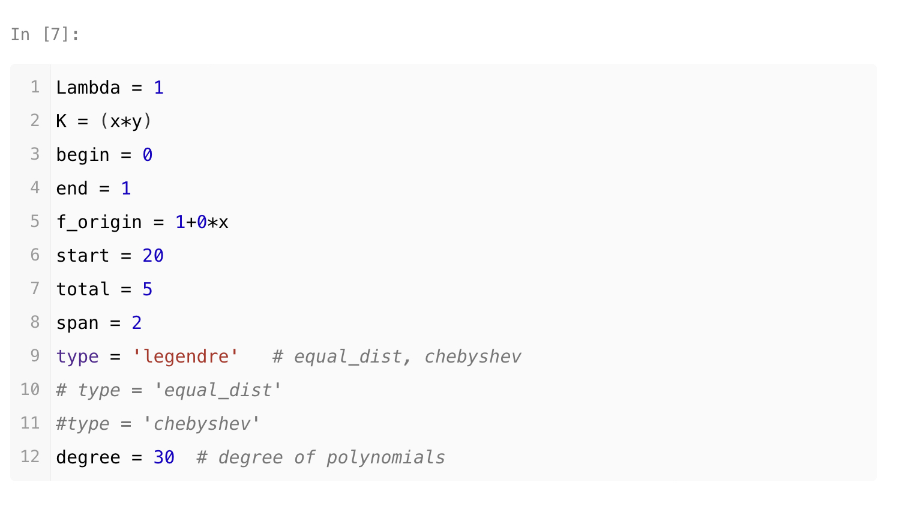
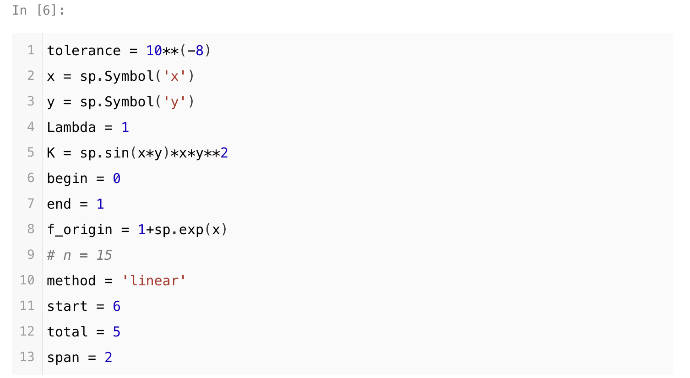
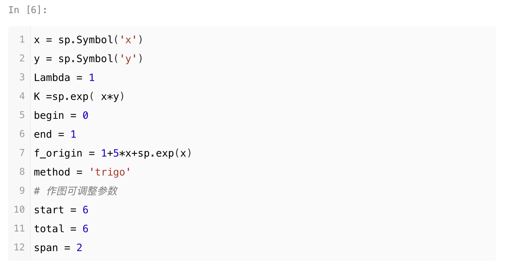
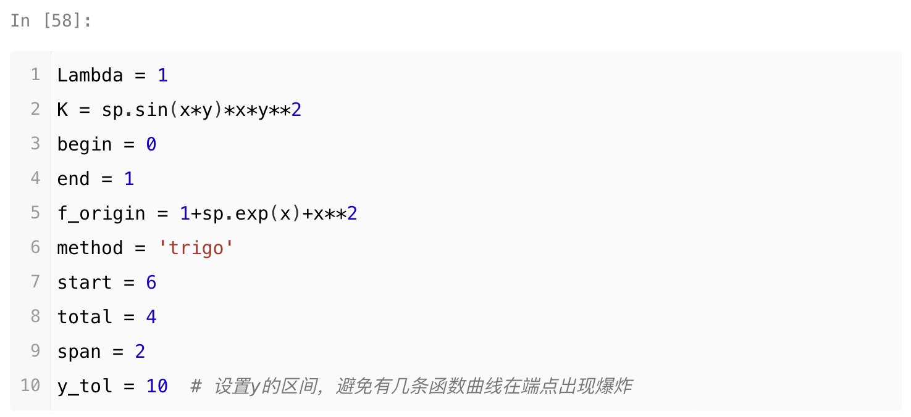
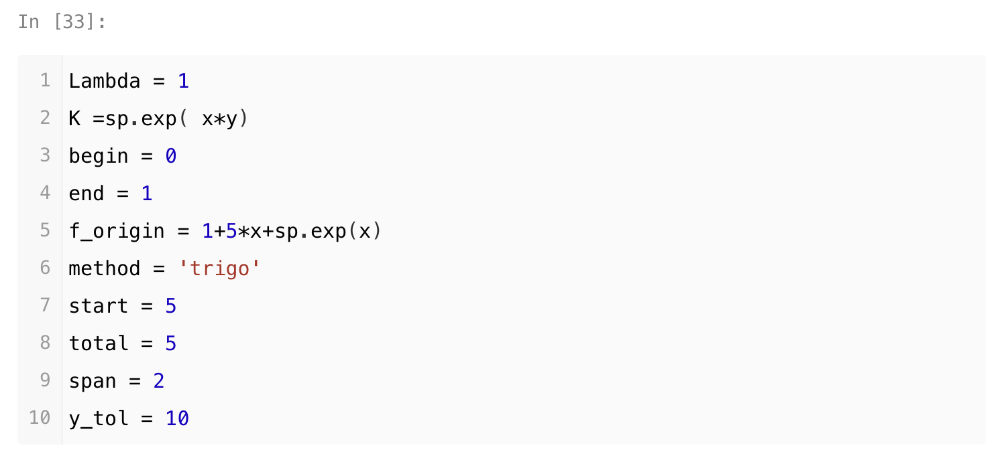

#  第二类Fredholm方程的解法

> 参考自 Kendall E.Atkinson 的 *The Numerical Solution of Intergral Equations of the Second Kind*。

文件目录：

```
├─配置投影迭代法
│  ├─Iter_Collocation.ipynb
│  └─配置投影迭代法.md
├─Galerkin投影迭代法
│  ├─Iter_Galerkin.ipynb
│  └─Galerkin投影迭代法.md
├─配置投影法
│  ├─Loop_Collocation.ipynb
│  └─配置投影法.md
├─Galerkin投影法
│  ├─Loop_Galerkin.ipynb
│  └─Galerkin投影法.md
├─插值退化核法
│  ├─Loop_Piecewise.ipynb
│  └─插值退化核法.md
├─Taylor退化核法
│  ├─Loop_Taylor.ipynb
│  └─Taylor退化核法.md
├─Representation.pdf
├─origin 
│  ├─Collocation_IE.ipynb
│  ├─Galerkin_IE.ipynb
│  └─Piecewise_IE.ipynb
└─image
```

在根目录下，除了Representation.pdf都是可以运行的笔记本。Representation.pdf是展示文档。

origin目录下则是单个函数本身，用作调试。

主要说一下每一个Jupyter Notebook中的可以修改的参数。具体如何修改请见各文档的说明文件。

1. Loop_Taylor.ipynb 为 Taylor级数展开的退化核方法。
2. Loop_Piecewise.ipynb为插值多项式的退化核方法
3. Loop_Collocation.ipynb为配置法的投影方法
4. Loop_Galerkin.ipynb为Galerkin的投影方法
5. Iter_Collocation.ipynb为配置法的迭代投影算法
6. Iter_Galerkin.ipynb为Galerkin法的迭代投影算法
